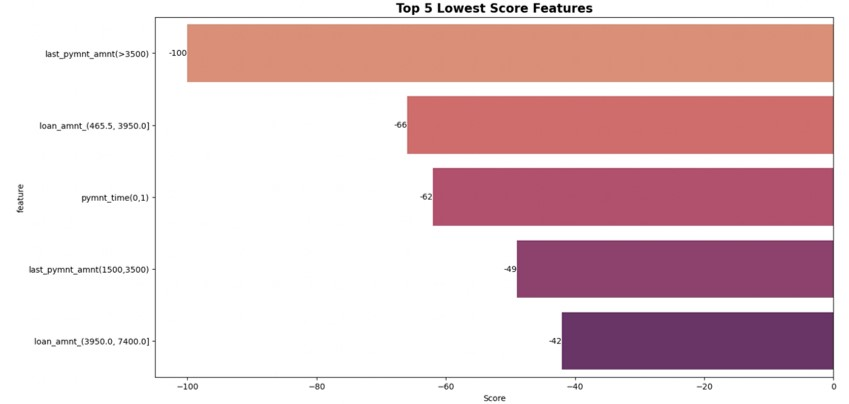

# Machine Learning Project Credit Risk Assessment (Using Logistic Regression) on ID/X Partners

## Project Description

A primary risk with corporate loans is failing in accurately assessing credit risk. Disadvantage of Manual credit risk assessment :

- Subjectivity can introduce bias and inconsistency in decision-making
- Time-consuming especially when dealing with a large number of loan applications.
- Humans errors, such as data entry mistakes, miscalculations, or oversight of important details

**Challenges :**  
Build a machine learning model that can predict credit risk assessment

## Project Goal

Build a machine learning model that can predict credit risk assessment

## Tools & Library Used

 &nbsp;
 &nbsp;

## Project Result

[Click here to get full code](https://github.com/nickenshidqia/Credit_Risk_Assessment_IDX_Partners/blob/906f1c14fe45de01844e1504028ff0b2d48ebe3c/Credit%20Risk%20Assessment%20%20-%20Nicken%20Shidqia%20N.ipynb)

### Exploratory Data Analysis

**Applicants by Loan Status** :  

- The majority of loan status distribution is current 47.95%, and fully paid 39.54%, it means that the borrower are meeting their payment obligation.
- There are significant number of charged off 9.08%. It means that the borrower has become delinquent on payments, and potential financial loss from the lender.
- Good loan status is either current and fully paid
- Bad loan status except for these 2 things

**Applicants by Borrower’s Status Rate** :  

- Good loan status got high percentage with 87.49%. It means that the bank's loan performing is good.
- Bad loan status got low percentage with 12.51%. It means the bank need to analyzing the characteristic of the borrower, so they could
  identify early warnings sign, and implement the mitigation from failure of pay loans from customers

**Applicants by Loan Purpose** :  

- Debt consolidation got the highest percentage for load purpose with 58.67%.
- Debt consolidation is preferred because the customer can taking out a single loan or credit card to pay off multiple debts
- The benefits of debt consolidation include a potentially lower interest rate and lower monthly payments.

**Applicants by Grade** :  

- Middle grade B and C got the highest percentage with 29.28% and 26.8%. It means that quality score to a loan based on a borrower's credit history, quality of the collateral, and the likelihood of repayment of the principal and interest are considered moderate
- Grade E,F,G got the lowest percentage. Grade E,F,G are high risk grade, because the likelihood that the borrower will repay the loan is low. So the loan company need to tighten the criteria for loan borrowers

**Applicants by Loan Term** :  

- 36 month of loan term got the highest percentage with 72.47%. It means that short term loan are preferred by borrowers rather than long term.
- Compared to long term loans, the amount of interest paid is significantly less.
- These loans are considered less risky compared to long term loans because of a shorter maturity date.
- Short term loans are the lifesavers of smaller businesses or individuals who suffer from less than stellar credit scores

**Applicants by Home Ownership** :  

- Mortgage got the highest percentage with 50.44%. The reason that mortgage customer is so many because a mortgage allows the customer to purchase a home without paying the full purchase price in cash.
- The second highest is rent with 40.35%. The reason that customer choose rent because no maintenance costs or repair bills, access to amenities like pool or fitness centre, no real estate taxes, and more flexibility as to where to live.
- The borrower that own their houses is only 8.9%.

### Feature Engineering with Weight of Evidence (WOE) & Information Value (IV)

- Weight of evidence (WOE) generally described as a measure of the separation of good and bad customers.
- Information value (IV) is one of the most useful technique to select important variables in a predictive model. It helps to rank variables on the basis of their importance.

### Modelling

**Best Parameter**  

- Best parameter we've got is L2 (Ridge) regularization with 'C' is 0.027 which is near to 0, and leads to stronger regularization and a simpler model.

**ROC/AUC**  

- AUC score = 0.93, which is near to 1, indicates good performance

**Classification Report**

- Precision tells us the accuracy of positive predictions. Out of all the loan status that the model predicted would get good loan, only 85% actually did.
- Recall tells us the fraction of correctly identified positive predictions. Out of all the loan status that actually did get good loan, the model only predicted this outcome correctly for 65% of those loan status
- F1 Score = 0.73. So the model does a good job of predicting whether the loan status is considered good or bad

**Confusion Matrix**  

- Correct classifications are the diagonal elements of the matrix 120,440 for the positive class and 10,841 for the negative class
- Accuracy rate, which is the percentage of times a classifier is correct = 94.09%

**Kolmogorov-Smirnov**

- KS Statistic = 0.736. Considered it as 'medium' dataset, which mean even though it doesn't have perfect separation, but there is enough overlap to confuse the classifier, and has wide gap between the class CDF (positive & negative instances).

### Score Card

**FICO Score**  

- FICO score is a credit score created by the Fair Isaac Corporation (FICO)
- Lenders use borrowers’ FICO scores along with other details on borrowers’ credit reports to assess credit risk and determine whether to extend credit.

**Top 5 Highest & Lowest Score Features**  

  
Features that make contribution to increase or decrease credit score are:
- initial list status
- last payment amount
- total payment
- loan amount
- payment time

**Bad Loan Rate on Loan Amount Based On Borrower's Score Status**  

- Customers who have a bad credit score with a loan amount ranging from 465-10,850 have the potential to become a bad loan in the future

**Bad Loan Rate on Payment Time Based On Borrower's Score Status**  

- The longer the customer's payment time takes to pay off the loan, the riskier customer's gonna potentially to be bad loan

### Recommendation

- Loan companies can build a robust and effective credit scoring model machine learning using variety of methods and criteria to assess the creditworthiness of potential customers.
- The goal is to minimize the risk of lending to individuals who are unlikely to repay their loans.
- One of method to evaluate a borrower incorporates both qualitative and quantitative measures is the 5 C's of credit (Character, Capacity, Capital, Collateral, and Conditions)
